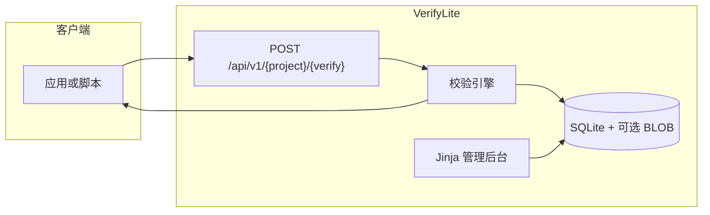

<p align="center">
  
</p>

<h1 align="center">VerifyLite</h1>

<p align="center">
  基于 Flask 的轻量远端许可证密钥校验服务。
</p>

<p align="center">
  <a href="README.md">English</a> · <a href="README-CN.md">简体中文</a>
</p>

<p align="center">
  
  
  
  
</p>

<p align="center">
  
</p>

VerifyLite 是一个小巧、可自托管的许可证服务：对客户端提供公开 JSON 校验接口，对管理员提供服务端渲染的管理后台，用于管理项目、验证方案、密钥、回复模板和调用日志。全部数据使用 SQLite 保存，也可以用 BLOB 存储在校验成功后返回的附件。

> 默认监听端口：**1921**

## 目录

- [目录](#目录)
- [项目亮点](#项目亮点)
- [工作方式](#工作方式)
- [环境要求](#环境要求)
- [快速开始](#快速开始)
  - [源码（virtualenv）](#源码virtualenv)
  - [Docker](#docker)
- [管理后台](#管理后台)
- [校验 API](#校验-api)
  - [模板占位符](#模板占位符)
- [校验规则](#校验规则)
- [配置](#配置)
- [目录结构](#目录结构)
- [安全说明](#安全说明)

## 项目亮点

- 公开校验接口，支持 JSON 或 `application/x-www-form-urlencoded`
- 参数 GUI 与 JSON 预览双向同步
- 批量发卡、TXT/CSV 导出、单钥与按批次吊销
- TTL、最大次数、`valid_from` / `valid_until` 和可选 HWID 绑定
- 用量看板与方案级调用日志
- 可选 BLOB 对象，成功模板可使用 `{{blob_url:name}}`
- 管理后台支持 English / 简中，以及 System / Dark / WeLight 主题
- venv 一键启动与 Docker Compose 部署

## 工作方式

VerifyLite 使用两层配置：

1. **项目（Project）** — 产品或租户，公开 slug 出现在 API 路径中。
2. **验证方案（Verification scheme）** — 从属于项目，包含密钥池、有效期规则、可选 HWID 绑定，以及各结果码的 JSON 回复模板。

客户端 `POST` 密钥和可选 HWID，服务端按方案规则校验并返回管理员设计的 JSON。未知项目、方案和密钥均使用 `invalid_key` 模板。



## 环境要求

- Python 3.10+（推荐 Python 3.12），或
- Docker 与 Docker Compose

## 快速开始

### 源码（virtualenv）

```bash
chmod +x scripts/start.sh
./scripts/start.sh
```

打开 [http://127.0.0.1:1921](http://127.0.0.1:1921)。首次运行会将 [`.env.example`](.env.example) 复制为 `.env` 并生成 `SECRET_KEY`；第一次访问浏览器会进入初始化页，请设置管理员用户名和至少 8 位的密码。

生产模式（Gunicorn）：

```bash
PROD=1 ./scripts/start.sh
```

### Docker

```bash
cp .env.example .env   # 请修改 SECRET_KEY
docker compose up -d --build
```

数据库文件为 `./data/verifylite.db`，存活检查地址为 `GET /healthz`。

## 管理后台

登录后：

1. 创建 **项目**（名称 + 公开 slug）。
2. 在项目下创建 **验证方案**。
3. 用 GUI 或 JSON 编辑方案参数，两边会保持同步。
4. 批量发卡并分发导出的密钥列表。
5. 在看板和方案日志中查看用量。
6. 在 **账户** 中修改管理员凭据。

顶栏提供浏览器返回 / 前进、**EN / 简中**语言切换，以及 **System / Dark / WeLight** 主题切换。

## 校验 API

```http
POST /api/v1/{project_slug}/{verify_slug}
Content-Type: application/json

{"key":"VL-XXXX-XXXX","hwid":"optional-machine-id"}
```

也接受包含 `key` 与 `hwid` 的表单请求。

```bash
curl -s -X POST http://127.0.0.1:1921/api/v1/<project>/<verify> \
  -H 'Content-Type: application/json' \
  -d '{"key":"VL-XXXX-XXXX","hwid":"optional-machine-id"}'
```

设计好的回复统一使用 HTTP `200`；客户端应读取 JSON 中的 `code` 字段。

### 模板占位符

| 占位符 | 含义 |
| --- | --- |
| `{{key}}` | 许可证密钥 |
| `{{hwid}}` | 机器码 |
| `{{expires_at}}` | 到期时间 |
| `{{remaining_uses}}` | 剩余次数，或 `unlimited` |
| `{{used_count}}` | 已成功使用次数 |
| `{{project}}` | 项目 slug |
| `{{verification}}` | 验证方案 slug |
| `{{now}}` | 服务器 UTC 时间 |
| `{{blob_url:name}}` | 校验成功后签发的短时下载地址 |

## 校验规则

按以下顺序检查：

1. 项目与方案存在且已启用
2. 密钥存在且未吊销
3. `valid_from` / `valid_until` 时间窗
4. TTL（从首次成功使用起算）
5. 使用次数（`used_count < max_uses`；`max_uses` 可为 `null` / `infty` 表示不限制）
6. 若开启 HWID：首次成功锁定，之后必须一致
7. 成功：`used_count + 1`，必要时写入 HWID，并渲染 `success`

失败模板：`invalid_key`、`not_yet_valid`、`expired`、`exhausted`、`hwid_mismatch`、`disabled`。

## 配置

环境变量见 [`.env.example`](.env.example)：

| 变量 | 说明 |
| --- | --- |
| `PORT` | 监听端口（默认 `1921`） |
| `SECRET_KEY` | Session、CSRF、BLOB 短链签名密钥 |
| `DATA_DIR` | SQLite 与数据目录 |
| `MAX_BLOB_SIZE` | 上传大小上限（默认与上限均为 `1000000000` 字节，即 1 GB） |
| `GUNICORN_WORKERS` | 生产 worker 数（SQLite 建议 `1`） |
| `GUNICORN_TIMEOUT` | Gunicorn 请求超时秒数（默认 `600`，便于大文件上传） |

## 目录结构

```text
app/
  blueprints/admin.py   管理端 SSR
  blueprints/api.py     公开校验 API 与 BLOB 短链
  verify_engine.py      纯校验与安全模板渲染
  models.py             SQLAlchemy 模型
  templates/            Jinja 页面
  static/               CSS、JavaScript 与网页资源
docs/assets/            README 标志与头图
scripts/start.sh        virtualenv 一键启动
Dockerfile
docker-compose.yml
```

## 安全说明

- 对外部署前务必修改 `SECRET_KEY`。管理员密码以哈希形式存在 SQLite 中，不写在 `.env`。
- 密钥明文存储，以便导出分发。
- 日志列表会遮罩密钥；数据库仍保存提交值。
- BLOB 下载链接为短时签名 token，仅在校验成功后签发。
- 没有 TLS 和强密码时，不要把管理端暴露到公网。
