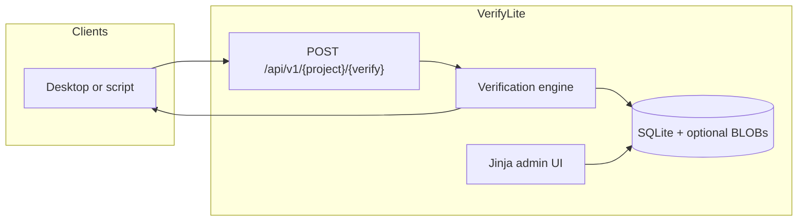

<p align="center">
  
</p>

<h1 align="center">VerifyLite</h1>

<p align="center">
  Lightweight remote license-key verification for Flask applications.
</p>

<p align="center">
  <a href="README.md">English</a> · <a href="README-CN.md">简体中文</a>
</p>

<p align="center">
  
  
  
  
</p>

<p align="center">
  
</p>

VerifyLite is a small, self-hosted license server. It exposes a public JSON endpoint for clients and a server-rendered admin console for managing projects, verification schemes, keys, response templates, and usage logs. Everything is backed by SQLite, with optional BLOB storage for files returned after a successful verification.

> Default listen port: **22222**

## Contents

- [Contents](#contents)
- [Highlights](#highlights)
- [How it works](#how-it-works)
- [Requirements](#requirements)
- [Quick start](#quick-start)
  - [Source (virtualenv)](#source-virtualenv)
  - [Docker](#docker)
- [Admin console](#admin-console)
- [Verify API](#verify-api)
  - [Template placeholders](#template-placeholders)
- [Verification rules](#verification-rules)
- [Configuration](#configuration)
- [Project layout](#project-layout)
- [Security notes](#security-notes)

## Highlights

- Public verify endpoint with JSON or `application/x-www-form-urlencoded` bodies
- Dual editor with a parameter GUI and synchronized JSON preview
- Batch key issuance, TXT/CSV export, single-key and batch revoke or delete
- Expiry date, maximum uses, optional `valid_from`, and optional HWID binding
- Usage dashboard and per-scheme call logs
- Optional BLOB objects referenced with `{{blob_url:name}}` in success templates
- English and Simplified Chinese admin UI, plus system/dark/WeLight themes
- One-command virtualenv start and Docker Compose deployment

## How it works

VerifyLite uses two levels of configuration:

1. **Project** — a product or tenant; its public slug appears in the API URL.
2. **Verification scheme** — a key pool, validity rules, optional HWID binding, and the JSON response templates for each result code.

Clients `POST` a key and optional HWID. The server evaluates the scheme and returns the administrator-designed JSON for that result. Unknown projects, schemes, and keys use the `invalid_key` template.



## Requirements

- Python 3.10+ (Python 3.12 recommended), or
- Docker and Docker Compose

## Quick start

### Source (virtualenv)

```bash
chmod +x scripts/start.sh
./scripts/start.sh
```

Open [http://127.0.0.1:22222](http://127.0.0.1:22222). On the first run, the script copies [`.env.example`](.env.example) to `.env` and generates `SECRET_KEY`. The first browser visit opens setup, where you choose an admin username and a password of at least eight characters.

For production with Gunicorn:

```bash
PROD=1 ./scripts/start.sh
```

### Docker

```bash
cp .env.example .env   # change SECRET_KEY
docker compose up -d --build
```

The database is stored at `./data/verifylite.db`; liveness is available at `GET /healthz`.

## Admin console

After signing in:

1. Create a **project** with a name and public slug.
2. Create a **verification scheme** under that project.
3. Edit scheme parameters in the GUI or JSON pane; both stay in sync.
4. Batch-issue keys and distribute the exported list.
5. Monitor usage on the dashboard and in scheme logs.
6. Change the admin credentials under **Account**.

The top bar includes browser history controls, **EN / 简中** language switching, and **System / Dark / WeLight** themes.

## Verify API

```http
POST /api/v1/{project_slug}/{verify_slug}
Content-Type: application/json

{"key":"VLYOURLICENSEKEY","hwid":"optional-machine-id"}
```

Form bodies with `key` and `hwid` are also accepted.

```bash
curl -s -X POST http://127.0.0.1:22222/api/v1/<project>/<verify> \
  -H 'Content-Type: application/json' \
  -d '{"key":"VLYOURLICENSEKEY","hwid":"optional-machine-id"}'
```

Designed replies use HTTP `200`; clients should inspect the `code` field in the JSON body.

### Template placeholders

| Token | Meaning |
| --- | --- |
| `{{key}}` | License key |
| `{{hwid}}` | Machine ID |
| `{{expires_at}}` | Expiry instant |
| `{{remaining_uses}}` | Remaining uses, or `unlimited` |
| `{{used_count}}` | Successful uses so far |
| `{{project}}` | Project slug |
| `{{verification}}` | Verification slug |
| `{{now}}` | Server UTC time |
| `{{blob_url:name}}` | Download URL issued after a successful verify (does not expire) |

## Verification rules

Checks run in this order:

1. Project and verification exist and are enabled
2. Key exists and is not revoked
3. `valid_from` / `valid_until` window (`valid_until` is the expiry date)
4. Usage count (`used_count < max_uses`; `max_uses` may be `null` / `infty` for unlimited)
5. HWID, when enabled: lock on first success and require a match thereafter
6. On success: increment `used_count`, persist HWID if needed, and render `success`

Failure templates are `invalid_key`, `not_yet_valid`, `expired`, `exhausted`, `hwid_mismatch`, and `disabled`.

## Configuration

See [`.env.example`](.env.example):

| Variable | Description |
| --- | --- |
| `PORT` | Listen port (default `22222`) |
| `SECRET_KEY` | Session, CSRF, and BLOB-token signing key |
| `DATA_DIR` | SQLite and data directory |
| `MAX_BLOB_SIZE` | Maximum upload size (default and cap `1000000000` bytes, 1 GB) |
| `GUNICORN_WORKERS` | Production workers; use `1` with SQLite |
| `GUNICORN_TIMEOUT` | Gunicorn request timeout in seconds (default `600` for large uploads) |

## Project layout

```text
app/
  blueprints/admin.py   Admin SSR
  blueprints/api.py     Public verify API and BLOB tokens
  verify_engine.py      Pure checks and safe template rendering
  models.py             SQLAlchemy models
  templates/            Jinja pages
  static/               CSS, JavaScript, and web assets
docs/assets/            README logo and hero artwork
scripts/start.sh        Virtualenv one-shot start
Dockerfile
docker-compose.yml
```

## Security notes

- Change `SECRET_KEY` before any public deployment. The admin password is hashed in SQLite, not stored in `.env`.
- License keys are stored in plaintext so they can be exported and distributed.
- The UI masks keys in call logs; the database still stores the submitted value.
- BLOB download links are signed tokens issued only after a successful verify; they do not expire.
- Do not expose the admin console to the internet without TLS and a strong password.
